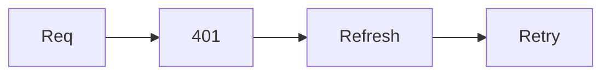

# PR

Title: MUST use a conventional prefix: `type(scope)?: description`
(`feat|fix|docs|style|refactor|perf|test|build|ci|chore|revert`, see
`conventional-commit`). Lowercase, imperative, no trailing period, <= 70 chars.
Type = dominant change of the PR, matching its branch (`worktree-naming`).
Examples: `feat(herdr): add target picker`, `fix(auth): refresh expired token`.
Never open or edit a PR with an unprefixed title.

## Template first

Before writing the body, look for a PR template in the project root:
`.github/pull_request_template.md`, `.github/PULL_REQUEST_TEMPLATE.md`,
`docs/pull_request_template.md`, `pull_request_template.md`, or any file in
`.github/PULL_REQUEST_TEMPLATE/` (multiple: pick the best fit, ask if unclear).

- Found: fill it in, keep its headings and order, don't invent sections.
  Delete HTML comments and placeholder text. Tick only checkboxes that are true.
  The concise/table/diagram rules below apply *inside* its sections.
- Not found: use the default structure below.
- Title prefix rule always applies, template or not.

Body: concise, clear, scannable. Reviewer should grasp the change in 30s.
No filler, no restating the diff line by line, no marketing tone.

Default structure (no template):
1. **Why** - 1-2 sentences: problem or goal.
2. **What** - short bullets of the changes that matter. Group by area.
3. **Notes** - only if needed: risks, migrations, follow-ups, how to test.

Use visuals when they beat prose (skip otherwise):
- **Table** - many files/modules/options, before vs after, config changes,
  behavior matrix.
- **Mermaid diagram** - flow, sequence, architecture, or state changes
  (`flowchart`, `sequenceDiagram`, `stateDiagram-v2`). Keep < ~10 nodes.
- **Code block** - only for a key snippet or before/after.

Example:

```md
## Why
Login tokens expired silently, users saw blank pages.

## What
| Area | Change |
|------|--------|
| `auth/` | refresh token on 401 |
| `ui/` | show session-expired banner |



## Notes
Needs `REFRESH_TTL` env var.
```

Rules:
- no empty sections; drop headings that have nothing to say
- link issues with `Closes #123`
- don't paste full diffs or file lists the PR UI already shows
- end with the attribution line required by the session, if any
