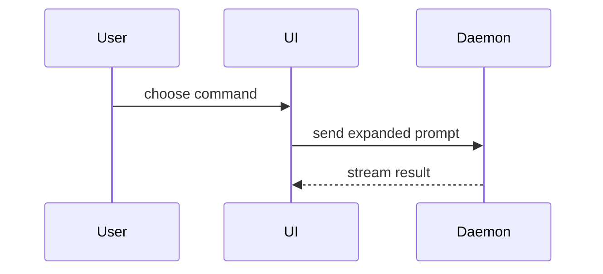

Help the user understand the current topic of conversation visually. Skip the preamble and keep prose brief. Pick the smallest view that makes the key point clear.

- Show logic or an algorithm as pseudocode:

```text
on(save)
  if content is unchanged
    return cached result
  write new content
  return fresh result
```

- Show runtime control flow as a call tree:

```text
submitForm
  createSession
    persistPrompt
    launchAgent
  navigateToSession
```

- Show UI structure as a component tree, including state and module boundaries that matter:

```tsx
<SessionPage> (apps/example/src/routes/session.tsx)
  useSessionEvents()
  <SessionToolbar>
    <RunSkillButton> (packages/ui)
```

- Show file responsibility or a broad refactor as a shallow file tree:

```text
src/
├── commands/       # parses user actions
├── sessions/       # owns session state
└── transport/      # sends API requests
```

- Show component interaction, control flow, or data flow with Mermaid:



- Use `diff` when the point is what changes and the surrounding shape already exists. Match the diff shape to the topic.

For a component change:

```diff
 <SessionPage>
   useSessionEvents()
   <SessionToolbar>
+    <RunSkillButton />
   <SessionTimeline>
+    <SkillResultCard />
```

For a file-layout change:

```diff
 src/
 ├── commands/
+│   └── show-me.ts       # expands the slash command
 ├── sessions/
-└── transport.ts
+└── transport/
+    ├── client.ts
+    └── stream.ts
```

For a call-tree or call-stack change:

```diff
 submitForm
   createSession
     persistPrompt
+    expandSkillMention
     launchAgent
-  navigateToSession
+  navigateToSession
+    subscribeToEvents
```

For a state or control-flow change:

```diff
 on(save)
-  write content
+  if content is unchanged
+    return cached result
+  write new content
+  invalidate cache
```

- Show the whole block when most of it is new, when omitted context would hide ownership or order, or when the user needs a copyable target shape:

```ts
function expandSkill(command: string): string {
  const skillName = command.slice(1)
  return `use the ${skillName} skill`
}
```

- When a visual only makes sense rendered (Mermaid, a wide table, rich Markdown), also write it to `${TMPDIR:-/tmp}/show-me.md` and open it with the nvim `markdown-preview.nvim` plugin. A headless nvim hosts the preview server, opens the browser, and exits by itself after 30 minutes. It reloads the file from disk every second, so later visuals only need a rewrite of the same file: the open browser tab updates in place. The command starts nvim only when no preview is running:

```
Bash(f="${TMPDIR:-/tmp}/show-me.md"; pgrep -f '^nvim --headless .*show-me\.md' >/dev/null || (nohup timeout 30m nvim --headless "$f" -c 'set autoread' -c 'call timer_start(1000, {-> execute("checktime")}, {"repeat": -1})' -c 'lua if vim.fn.has("wsl") == 1 then require("markdown_preview").setup({ browser = { "cmd.exe", "/c", "start", "" } }) end' -c MarkdownPreview >/dev/null 2>&1 &))
```

  On WSL the `lua` line points the plugin's browser at `cmd.exe /c start`. The plugin's own default is `wslview`, which goes through PowerShell and fails when Windows policy locks PowerShell in Constrained Language Mode.

  Keep the same visual in the chat reply too, so the user can still read it in the terminal.

- For a visual UI, layout, state comparison, or concept too dense for Mermaid, write one focused HTML file — a diagram, an infographic, or a short slide deck, whichever fits the point. Match the product's colors, type, spacing, and components; use real labels and data; support desktop and mobile. Then open it for the user with the opener that matches the platform (`cmd.exe /c start` on WSL opens the Windows browser, and it avoids `wslview`, which fails under PowerShell Constrained Language Mode; `open` on macOS; `xdg-open` on Linux):

```
Bash(f=path/to/show-me-{description}.html; if grep -qi microsoft /proc/version; then (cd /mnt/c && cmd.exe /c start "" "$(wslpath -w "$f")"); elif [ "$(uname)" = Darwin ]; then open "$f"; else xdg-open "$f"; fi)
```

### guidance

Place each visual next to the short text it supports. Keep only the calls, files, props, states, and boundaries needed to answer the user's current question or the options to resolve the current discussion point.

You may use one of these, you may use several, it is unlikely you will use all of them. Use your judgement and don't overwhelm the user.
